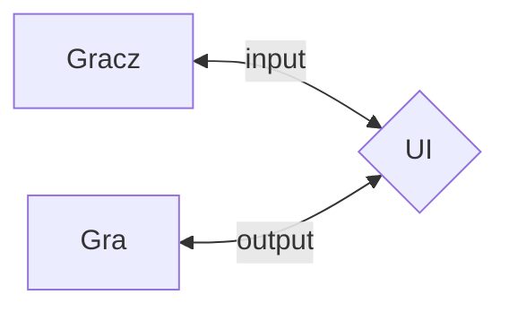
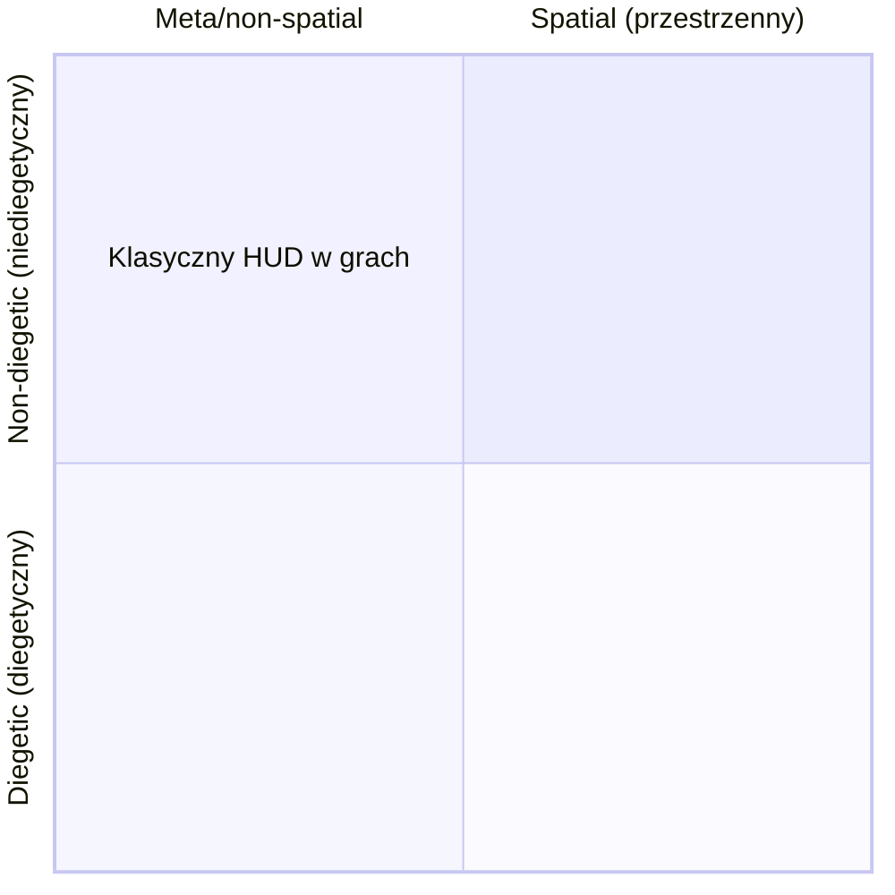
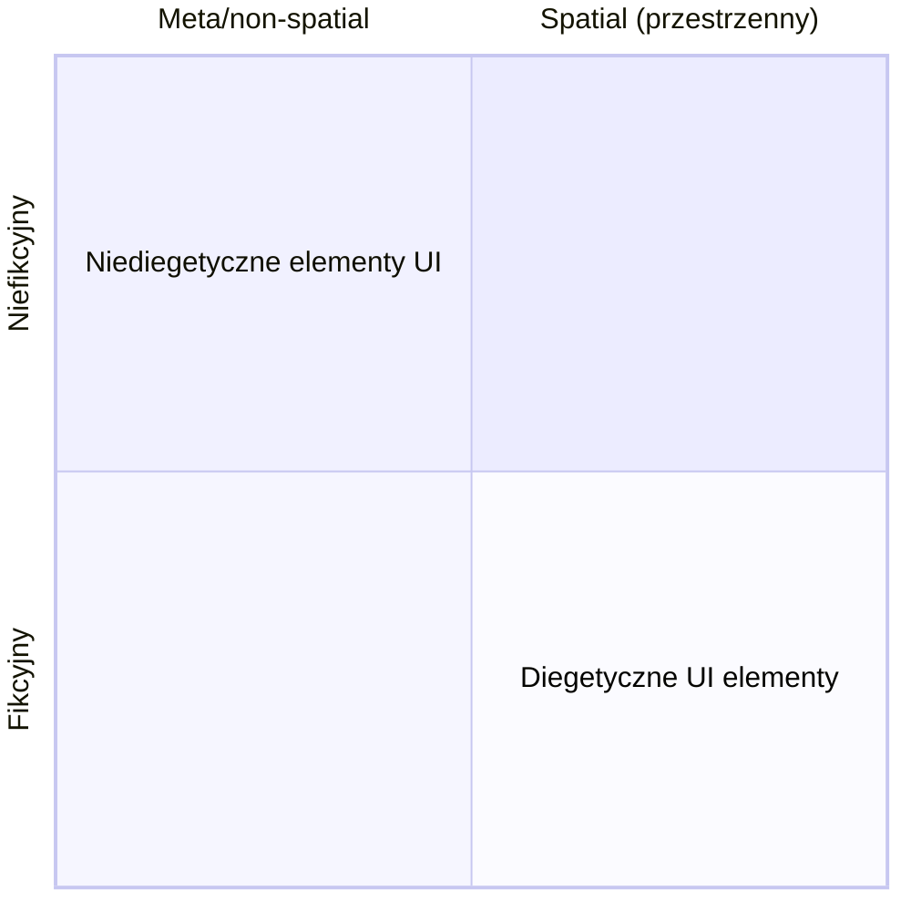
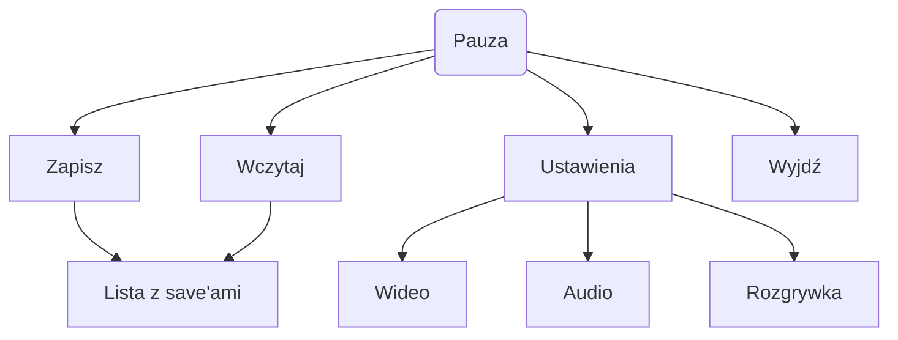
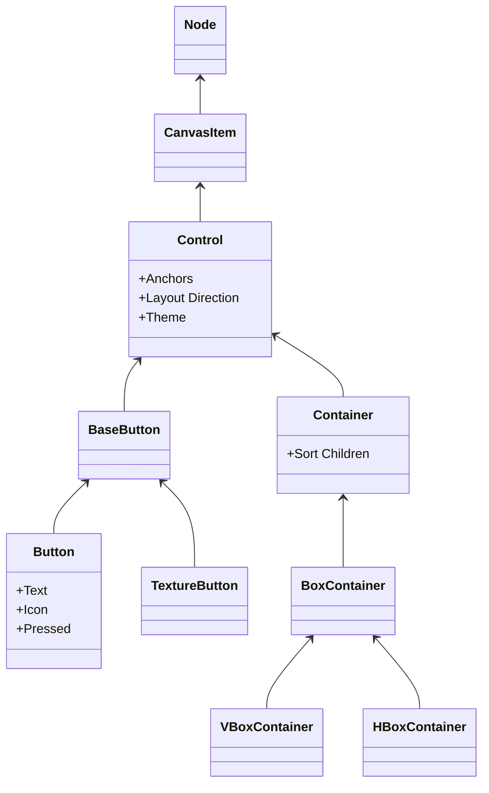

# UI/UX

## Moduł teoretyczny

Menu główne to jest unsung hero. Niby pierwsze wrażenie robi się na tutorialu, ale to nie jest do końca prawda[^1]. Pamiętam zawód ludzi, nie tylko pod względem nie zmienionej treści, jej wypaczenia, czy nawet wycięcia, ale także pod względem rozbicia spójności, przy premierze **Warcraft 3: Reforged**[^2]. Oryginalne (2002) menu główne było spójne, super zanimowane, bardzo klimatyczne, a wybór danej kampanii przede wszystkim *diegetyczny*. Natomiast wersja **Reforged** (przed patchami) zastąpiła to płaską nakładką webową (Chromium embedded).

### User Interface

Gracz komunikuje się z grą za pomocą UI. 

Mamy na uwadze, że UI powinno wpasowywać się w tematykę, paletę kolorystyczną oraz motyw samej gry!

Przykładowo: gra jest ręcznie rysowana to i w tym stylu robimy głównemu menu.

W 2009 roku Erik Fagerholt i Magnus Lorentzon w swojej pracy dyplomowej na Uniwersytecie w Göteborgu stworzyli podział, który stał się standardem w branży[^3].

Jak to rozumieć?

- **Non-diegetic (niediegetyczny)** -- Klasyczny HUD. Paski zdrowia, punkty. Postać tego nie widzi, tylko gracz. Np. amunicja w boomer shooterach.
- **Diegetic (diegetyczny)** -- Klasyczek = Dead Space i to jak tam widzimy pasek życia oraz odpowiednik many. Kolejnym fajnym przykładem jest gradaptacja King Konga z 2005. Ubisoft tak nagotował, że to jest aż dziwne.
- **Spatial (przestrzenny)** -- Elementy zawieszone w świecie 3D, ale postać ich nie widzi (np. linia wyścigowa w *Forzie*).
- **Meta** -- Istnieje na płaskim ekranie, ale pasuje do fikcji (np. w Call of Duty).

### Gdzie szukać inspiracji

Wszędzie! Dobrymi stronkami do przeglądania UI są:

- [https://www.gameuidatabase.com](https://www.gameuidatabase.com).
- [https://interfaceingame.com](https://interfaceingame.com).

### Fundamenty

Nie ma potrzeby wynajdowania koła na nowo. Nasi przodkowie to goaciki.

1. **Prawo Jacoba** – użytkownicy spędzają większość czasu w innych grach, więc oczekują, że Twoja będzie działać tak samo[^4]. Przykładowo: ekwipunek pod [I], pauza pod [Esc].
	- Niemniej może to być broń obosieczna. Musimy mieć na uwadze, że nie każda osoba grająca jest *game literated*, tak jak chociażby my, czy nasz wyobrażony sobie gracz docelowy[^5].
2. **Prawo Fittsa** – czas potrzebny na dotarcie do celu zależy od stosunku dystans/rozmiar.
3. **Hierarchia wizualna** – oko gracza podąża tam gdzie świeci, błyszczy i w ogóle się dzieje.

### Minimalizm

Panuje przeświadczenie, zapewne pierwotnie słuszne, że dobre UI to minimalne UI. Ale z tego się robi taki błąd poznawczy, jak z powiedzenia "nie wchodzi się dwa daw razy do tej samej rzeki", czy "Kończ waść, wstydu oszczędź". W grach **MMO** (jak *WoW*) czy strategiach, gracz potrzebuje tłuściutkich informacji. Ukrywanie danych zwiększa tzw. *cognitive load* – gracz musi pamiętać, co gdzie jest, zamiast to widzieć. Kontekst definiuje czytelność.

### Ćwiczenie 1.

1. Daję słowa (gatunek/tag, setting)
2. Wchodzicie na [https://www.gameuidatabase.com](https://www.gameuidatabase.com) lub [https://interfaceingame.com](https://interfaceingame.com).
3. Składacie w Figmie inspiracje + rodzaj (diegetyczny, czy nie) i dlaczego tak.

### User eXperience

Jest to nic innego jak zbiór informacji, które gra kumuluje i jak są one przekazywane graczowi.  Przykład na podstawie pauzy.

### Game Feel

To jest ten juice, kiedy atakujecie i czujecie uderzenie (gra zatrzymuje się na kilka klatek, przykładowo w street figterze), kiedy zbieranie surowce i dźwięk jest niesamowicie satysfakcjonujący. **Gameplay** trzeba mieć, **narracja** jest superancka, ale **game feel** to jest trzeci filar, który też jest być albo nie być gry[^6].

## Praktyka czyni mistrza

### UI/UX w UI Godota

**Theme** vs **Theme Override**.

Nie trzeba stylizować każdego przycisku z osobna, dzięki opcji **Theme Resource** w **Theme**, jesteśmy w stanie stworzyć swój własny wzór przycisku, w naszej gierce.

`Control`, czyli **Anchor** vs **Container**. Node `Control` ma faktycznie w inspektorze pozycję, którą możemy edytować. Niemniej starajmy się używać kontenerów (container/box), które decydują o pozycji childów (dzieci).

### Ćwiczenie 2.

> Nie trzeba tworzyć **Theme**! Wystarczy sama praca na **Theme Override** :)

1. Otwieramy Godota.
2. Robimy proste menu główne (3-4 przyciski wystarczą).
3. Zmieniamy styl przycisków i dodajemy im reakcję na najechanie.

Nie chodzi o funkcjonalność, o rodzaj czy typ menu. Chodzi tylko o to, aby przećwiczyć stylowanie node'ów `Control`.

## Bibliografia

1. Avard Alex, *The hidden value of video game main menus, and the design secrets that compel you to hit play*, „GamesRadar+” 2020, https://www.gamesradar.com/the-hidden-value-of-video-game-main-menus-and-the-design-secrets-that-compel-you-to-hit-play/ (dostęp: 23.01.2026).
2. Fagerholt Erik, Lorentzon Magnus, *Beyond the HUD: User Interfaces for Increased Player Immersion in FPS Games*, Chalmers University of Technology, Göteborg 2009.
3. Godot Engine Documentation, User Interface (UI), https://docs.godotengine.org/en/stable/tutorials/ui/index.html (dostęp: 23.01.2026).
4. Hodent Celia, *The Gamer's Brain: How Neuroscience and UX Can Impact Video Game Design*, CRC Press, Boca Raton 2017.
5. Nielsen Jakob, *Jakob’s Law*, https://lawsofux.com/jakobs-law/ (dostęp: 23.01.2026).
6. Nijman Jan Willem, *The Art of Screenshake*, wykład podczas INDIGO Classes, 2013.
7. Norman Don, _The Design of Everyday Things_, Basic Books, New York 2013.
8. Schreier Jason, *Blizzard Botched Warcraft III: Reforged Due To Budget Cuts, Internal Arguments*, „Bloomberg” 2021.
9. Sharman Adam, *Why Game Menus Matter*, „Medium” 2024, https://medium.com/@ThatOneAJ/why-game-menus-matter-b303ddf9cb09 (dostęp: 23.01.2026).

## Ludografia

1. *Assassin's Creed Odyssey*, prod. Ubisoft Quebec, wyd. Ubisoft, 2018.
2. *Call of Duty 4: Modern Warfare*, prod. Infinity Ward, wyd. Activision, 2007.
3. *Dead Space*, prod. Visceral Studio, wyd. Electronic Arts, 2008.
4. *Forza Motorsport* (seria), prod. Turn 10 Studios, wyd. Xbox Game Studios.
5. *Of Salt & Solace*, prod. Saminton, 2025.
6. *Peter Jackson’s King Kong*, prod. Ubisoft Montpellier, wyd. Ubisoft, 2005.
7. *Street Fighter* (seria), prod. Capcom, wyd. Capcom.
8. *Warcraft III: Reign of Chaos* oraz *The Frozen Throne*, prod. Blizzard Entertainment, wyd. Blizzard Entertainment, 2020.
9. *World of Warcraft*, prod. Blizzard Entertainment, wyd. Blizzard Entertainment, 2004.

[^1]: Avard Alex, *The hidden value of video game main menus, and the design secrets that compel you to hit play*, gamesradar, 2020, https://www.gamesradar.com/the-hidden-value-of-video-game-main-menus-and-the-design-secrets-that-compel-you-to-hit-play/.
	Sharman Adam, *Why Game Menus Matter*, Medium, 2024, https://medium.com/@ThatOneAJ/why-game-menus-matter-b303ddf9cb09.

[^2]: Schreier Jason, *Blizzard Botched Warcraft III: Reforged Due To Budget Cuts, Internal Arguments*, Bloomberg, 2021.

[^3]: Fagerholt Erik, Lorentzon Magnus, *Beyond the HUD. Chalmers University of Technology*, Chalmers University of Technology, Göteborg 2009.

[^4]: J. Nielsen, Jakob’s Law, [online] https://lawsofux.com/jakobs-law/ (dostęp: 23.01.2026).

[^5]: Słowa Celii Hodent, byłej dyrektor UX w Epic Games (Fortnite). Zobacz: Hodent Celia, *The Gamer's Brain: How Neuroscience and UX Can Impact Video Game Design*, CRC Press, Boca Raton 2017.

[^6]: Nijman Jan Willem, *The art of screenshake*, wykład podczas INDIGO Classes, 2013.
