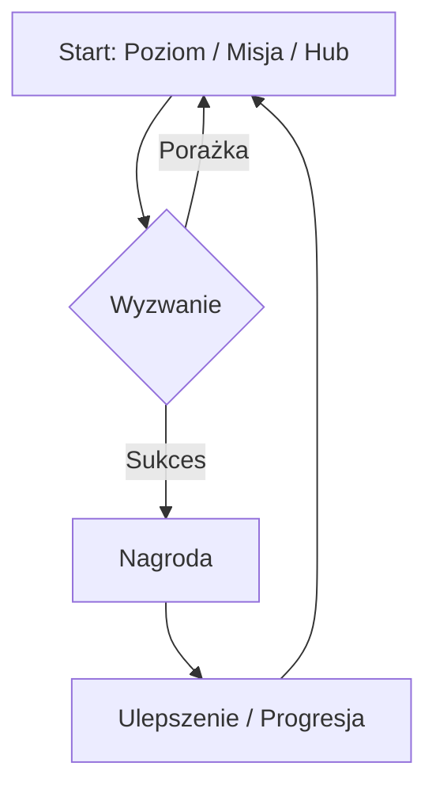

# Design Doc

## ## Roboczy tytuł (np. Projekt x)

Najnowszy taki tytuł jaki przychodzi mi na myśl to '**Project Orion**' - innymi słowy Cyberpunk 2.

> "*Orion is a codename for our next Cyberpunk game, which will take the Cyberpunk franchise further and continue harnessing the potential of this dark future universe*"[^1].

Dlaczego w game devie twórcy nazywają tak swoje projekty? Aby zostawić sobie przestrzeń na późniejsze zmiany. Dosłownie. Idzie się łatwo zdziwić jak późno w produkcji gry są dopiero nazywane lub nadal mają zmieniane tytuły.

To daje też podświadomie przestrzeń na eksperymentowanie formą i treścią, nie narzucamy sobie w ten sposób żadnej sztywnej ramy[^2].

## O grze

W tym segmencie można, a nawet trzeba dać krótki i (najlepiej) chwytliwego jednozdaniowca o grze, tzw. **pitch**. 

### Pitch
Przykładowo "*dziecko Candry Crush oraz Sapera*", jakby, ze świecą szukać kogoś kto by nie zagrał.
### Podsumowanie

Krótki opis gry. Co robi gracz? Jaki jest cel?

### Szczegóły techniczne

- **Grupa docelowa (Demographics):** [np. Miłośnicy pociągów, Gracze hardcorowi]
- **Gatunek/Tagi:** [np. Metroidvania, FPS, Cosy, Roguelike]
- **Silnik (Engine):** [np. Godot, Unity, Unreal]
- **Podobne tytuły / Inspiracje:** [np. Blackthorne (1994), Celeste]

## Gameplay

### Core Loop (Pętla rozgrywki)

Cykl, który gracz, który gracz najczęśniej powtarza.

NIE TRZEBA KORZYSTAĆ, Z TEGO FIKUŚNIKA POD SPODEM, JAKIEGOŚ KOD DIAGRAMU. WYSTARCZY Z [draw.io](https://app.diagrams.net).

### Główne systemy (i mechaniki)

- `Movement` (Poruszanie się): [np. Podwójny skok, dash, wspinaczka]
- `Combat` (Walka): [np. Turowa, czas rzeczywisty, logika pocisków]
- `Progression` (Progresja): [np. Drzewka umiejętności, odblokowywanie poziomów]

## Design & Estetyka

### UI / UX

- **HUD:** [Co jest na ekranie? Pasek zdrowia? Amunicja? Minimapa?]
- **Interfejsy:** [Diegetyczne (w świecie gry) czy nakładki?]

### Wideo / Wizualia

- **Art style:** [np. Low-poly, Pixel art 16-bit, Ręcznie rysowane]
- **Perspektywa:** [np. Top-down, First-person (FPP), Izometryczna]

### Audio

- **Muzyka:** [Gatunek, warstwy muzyki adaptacyjnej]
- **SFX:** [Kluczowe efekty dźwiękowe, ambient otoczenia]

## Narracja & Worldbuilding

### Główny motyw (Theme)

Jaka jest "dusza" gry? (np. "Rodzina jest ok albo i nie", "Samotność", "Ludzie są mili", "Honor")

### Worldbuilding

- **Setting:** [np. Cyberpunkowe Tokio, Noir lat 20., Fantastyczny Las]
- **Lore:** [Krótka historia lub zasady rządzące światem]
- **Postacie:** [Motywacja protagonisty, cel antagonisty, czy są postacie poboczne?]

## Notatki i luźne pomysły

_Pomysły, które są fajne, ale jeszcze niezweryfikowane lub niezaimplementowane. Trzymaj je tutaj, żeby nie zaśmiecały głównego designu._

- [ ] Może dodać minigrę w łowienie ryb?
- [ ] Pomysł na DLC: Poziomy w kosmosie?
- [ ] Pomysł na mechanikę: Cofanie czasu (może być zbyt dziwne w kodowaniu)

## Nie wypal się!

Pisanie długiego dokumentu jest męczące i czasem odciąga od samej radości tworzenia gry!!

- Używaj diagramów, tak jak w sekcji [[#Core Loop]], do wizualizacji logiki.
- **Kill your darlings.** Jeśli jakaś funkcja (feature) nie jest fajna w prototypie, przenieś ją do [[#Notatki i luźne pomysły]].
- **Aktualizuj, jeśli musisz.** Design może się zmienić po każdym playteście (i to jest jakby OK).

[^1]: [CD PROJEKT wraps up the beginning of 2025](https://www.cdprojekt.com/en/media/news/cd-projekt-wraps-up-the-beginning-of-2025/).
[^2]: [Joey Aghion, *Why Projects Need Code Names*, 2019.](https://artsy.github.io/blog/2019/05/10/why-projects-need-codenames/).